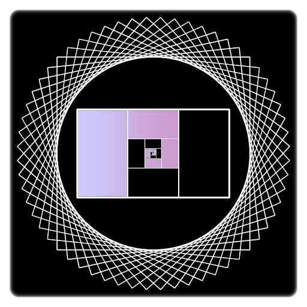

title: RWKV Wiki

## 欢迎来到 **RWKV Wiki**

> **RWKV** is an **attention-free RNN**, thus **faster** and **saves VRAM**. It also supports a GPT-mode for parallelized training.  
> **RWKV** 是一种**无需注意力**机制的**循环神经网络**，因此速度更**快**且更**省**显存。它还支持 GPT 模式并行训练。
> 
> —— Peng Bo，RWKV 作者，Reddit  
> （原文为 RWKV-4）

**[RWKV](https://github.com/BlinkDL/RWKV-LM)** 是由 Peng Bo 受 AFT（Attention-Free Transformer）等语言模型启发，设计并进一步开发的一种**大型语言模型**（Large Language Model）。

**RWKV Wiki** 是由 RWKV 社区自发创办的开放文档站点，致力于持续整合 RWKV 模型的有关资料，并推进 RWKV 及有关模型的开发。

## 我怎么感觉它和 [R-Transformer](https://arxiv.org/abs/1907.05572) 没啥区别呢？

严格来说二者根本不是一类模型，甚至设计的动机都不一样。 R-Transformer 是针对高维嵌入导致位置编码失效的解决方案，而 RWKV 是针对 Self-Attention 的改进。

 GPT 与 RWKV 的区别

包括 GPT、BERT，以及前面提到的 R-Transformer 在内，所有基于 Self-Attention 的模型（一般称为 Transformer）都面临以下两个问题：

* Self-Attention 使用的缩放点积注意力并不包含 Token 以及 Token 之间的位置信息。
* 整个序列中的每个 Token 都需要相互运算，导致训练与推断复杂度不佳（$O(n^2)$）。

RWKV 通过使用 [WKV 计算](model/wkv.md) 代替 Self-Attention 同时解决了上述两个问题：

* WKV 计算过程直接向 Token 引入了具有平移不变性的位置编码，不需要引入额外的位置编码。
* Token 之间无需相互运算，WKV 计算过程只对各 Token 分别变换并累加结果（$O(n)$）。

此外，WKV 计算也可以实现类似 Self-Attention 的 Cache，从而在连续推断时也有 $O(n)$ 的时间复杂度。在这种实现下，模型的内部状态是定宽的，符合 RNN 特征。

同时，WKV 计算也可以使用互相关运算表示，从而可以使用 CNN 的各种优化技巧。技术细节参见本 Wiki 的技术细节章节。

更多常见问答请见 [FAQ](intro/faq.md)。

## 好吧，那 RWKV 到底长个什么样？

如前图所示，RWKV 模型使用两个 RWKV 层替换掉了 Transformer 块中的 Multi-Head Attention 块和前馈网络层。

序列张量输入 RWKV 块后，首先进入 Time-Mix RWKV 层，其中各词向量的每组分量（在 RWKV 中被称作通道，Channel）分别以不同的强度从前往后混合，再经过不同的收缩，从而得到一个中间表示。

这个中间表示经过简单处理后就进入了 Channel-Mix RWKV 层。其中，每个中间向量的各通道再互相混合，之后经过另一次分通道收缩，就得到了 RWKV 块的输出张量。

以上过程只是 RWKV 的核心思想，更完整的细节请见 [结构总览](model/summary.md)。

## RWKV 相较于其它大型语言模型的特点

### RWKV 具有 RNN-CNN-Transformer 三象性

*TBD*

### RWKV 速度更快

*TBD*

### RWKV 更省显存

*TBD*

### RWKV 更易收敛，表现更优

AFT 也很快很省，但 AFT 权重矩阵的低秩特征[^2]使其不易收敛。*TBD*

[^2]: AFT 计算的权重矩阵是通过两矩阵相乘得到的，容易因退化导致平移不变性丧失。

### RWKV 支持近乎无限长度

RWKV 模型在训练和推理时，每个 Token 的计算量与模型的状态大小都基本不变，这使得 RWKV 可以做到近乎无限长度[^1]序列的训练和推理。

[^1]: 有必要指出，受数值精度、序列读入时间及空间占用等影响，实际不能达到无限长度。但这并不是 RWKV 的问题。

## 致谢

本项目受 CTF Wiki 及 OI Wiki 的启发，在排版过程中参考了诸多资料，在此一并致谢。

罗马不是一天建成的，RWKV 的建设也离不开许多人的帮助，而且需要更多有志之士的参与。

受篇幅所限，完整的致谢名单不能在此列出，[请点击这里访问](intro/thanks.md)。
